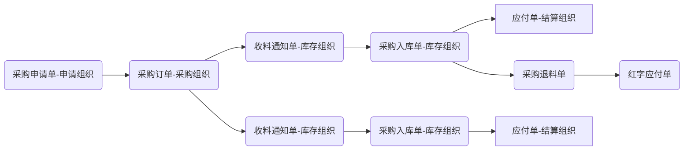
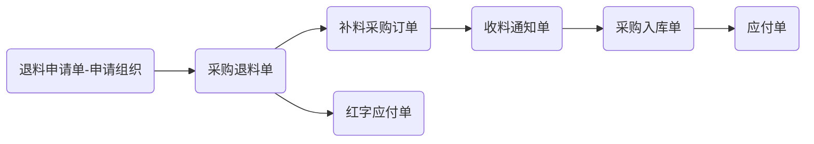
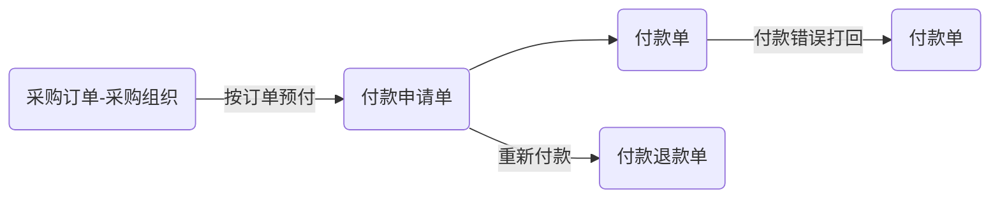
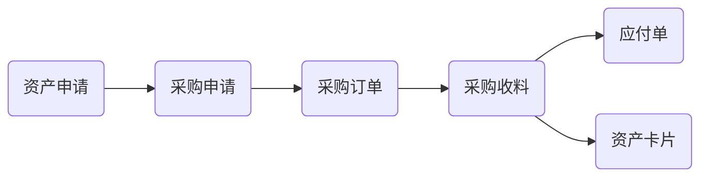
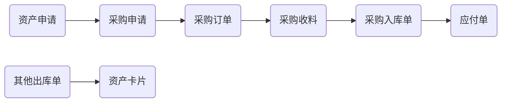

# 1. 多组织体系（单法人多事业部）

## 1.1 单法人多事业部组织体系的搭建

```
蓝海通讯公司
	公司总部
		采购部，销售部，财务部，企管办，人事部
	手机事业部
		生产办，手机生产车间
	平板事业部
		生产办，平板生产车间
```

业务介绍：

1. 蓝海通讯公司是单法人组织
2. 生产方面有手机事业部和平板事业部
3. 通讯公司统一对外接单和采购，事业部独立收货，统一对外收付款；
4. 事业部生产的产品以内部交易价卖给蓝海通讯公司；

Administrator:

    系统管理 - 组织机构 - 组织快速启用 - 多组织实施向导：

```
总公司信息：完善单法人的信息，核算组织必须是法人，必须是业务组织，且根据实际情况勾选对应的业务职能。
法人公司信息：企业是单法人，所以只有一个法人公司
法人公司明细信息：
	法人组织模式： 企业是多事业部的应用，所以法人组织模式选择多事业部模式。
		独立法人模式: 法人组织为一个整体单位进行运营与考核
		多事业部模式：法人组织内部设立多个利润中心，类似法人核算一样，在组织间以市场转移定价机制来进行内部组织考核；
		多业务组织模式：法人组织内设立多个业务实体，以实现各业务实体之间的数据隔离需求。
	下级业务组织
		根据选择的多事业部模式，自动添加一行本部的记录，可以修改编码和名称，选择组织职能。
		新增行 录入 手机事业部，平板事业部
预览组织架构图：创建
```

## 1.2 单法人多事业部会计核算体系的搭建

蓝海通讯公司的手机事业部和平板事业部要求独立核算：

Administrator: 基础管理 - 基础资料 - 财务会计 - 会计核算体系

```plaintext
系统默认创建法人核算体系，因为是单法人，直接在默认核算体系修改即可。反审核修改
单法人，肯定是法人核算体系，且是默认核算体系。
核算组织：默认是顶层组织，单法人不用修改，可以选择会计政策。
下级组织：蓝海通讯公司（本部）， 手机事业部，平板事业部；
保存，提交，审核 =========================================

新增会计核算体系：
基本：手机和平板事业部独立考核，则需要创建事业部核算体系。
核算组织：选择三个利润中心：蓝海通讯公司（本部）， 手机事业部，平板事业部
下级组织：每个核算组织的下级组织都是自己。
```

1. 这样就通过事业部体系实现手机和平板事业部的独立核算。
2. 在财务会计核算体系下，蓝海通讯公司需要创建对应的账簿，进行账务处理。
3. 在事业部体系下，手机事业部和平板事业部分别创建对应的账簿，进行账务处理，就可以出局事业部的利润表； 本部因为不需要考核，不需要创建账簿；

# 2. 多组织体系（单集团多法人）

```plaintext
蓝海实业集团
	蓝海电子公司
		采购部，销售部，财务部，企管办，人事部，生产部
	蓝海销售公司
		采购部，销售部，财务部，企管办，人事部
	蓝海香港公司
		采购部，营销部，财务部，HR部
```

业务场景：

1. 蓝海实业集团不存在，是个虚拟组织，下面有三个法人组织，各自经营业务；
2. 蓝海电子公司负责生产主板，只卖给蓝海销售公司以及蓝海香港公司；

## 2.1 单集团多法人的业务组织体系搭建

Administrator [系统管理 - 组织机构 - 组织快速启用 - 多组织实施向导]

```plaintext
总公司信息： 蓝海实业集团虽然是不存在，但是作为顶层组织必须是选择核算组织=法人，然后不给业务职能即可。这样就可以实现基础资料的统管。
法人公司信息：【蓝海电子公司，蓝海销售公司，蓝海香港公司】三个法人组织则可以直接在法人公司信息中直接维护
法人公司明细信息：
	法人组织：【蓝海电子公司，蓝海销售公司，蓝海香港公司】由于都是法人，所以选择独立法人模式。
查看结构，创建组织。
```

## 2.2 单集团多法人的会计核算体系搭建

Administrator [基础管理 - 基础资料 - 财务会计 - 会计核算体系]

```plaintext
默认的会计核算体系反审核修改：
核算组织：默认有一条蓝海实业集团， 新增【蓝海电子公司，蓝海销售公司，蓝海香港公司】
下级组织：选择每个法人组织的下级组织，也就是自己。
```

1. 完成会核算体系，重新提交并审核即可。
2. 由于蓝海实业集团是不存在的企业，所以不需要创建账簿。如需要三个法人的合并信息，则可以通过合并报表的合并方案解决。
3. 其他三个法人组织则需要创建对应的账簿。

# 3. 物料

物料通过【允许采购】【允许销售】【允许生产】【允许委外】【允许资产】【允许库存】等字段，控制物料的使用用途。

### 3.1 物料属性设置：

1. 自制：物料属性为自制，表明该物料是企业自己生产制造出的产成品。在系统中，自制件一般可以进行BOM设置，自制件可以设置为父项，也可以设置为子项。
2. 外购：物料属性为外购，是指为进行生产产品或者提供维护等原因而从供应商处取得的物料。外购件一般可以作为原材料来生产产品，也可以直接用于销售。
3. 委外：物料属性为委外加工，是指该物料需要委托其它单位进行生产加工的物料。
4. 虚拟件：物料属性为虚拟件，是指有一组具体物料（实件）组织的，以过渡形式存在的成套件。比如电子行业的玻璃面板生产，玻璃面板有液晶，偏关版和玻璃基板组成。玻璃面板的工艺路线为：
   1. 液晶和玻璃基板先切割成小玻璃
   2. 灌注液晶生成灌注液晶的小玻璃
   3. 贴上偏光片生成最终的玻璃面板
      此时为便于车间管理，将灌注为液晶的产品定义为一种物料，而该物料正常情况下不会入库，也不会发生销售业务，而只是车间中物料形态，这样的物料被称之为虚拟件。
5. 配置件：可以根据不同的客户需求生产或组装出不同特性产品的物料。例如电脑等。
6. 特征件：特征件不是具体的实际物料，而是具有某些特征的一类物料。例如：内存包含很多容量有2G， 4G， 8G等，品牌有三星，金士顿等，如果把具有一定特性的内存统称起来建立物料， 如：三星内存，金士顿内存，8G内存，这些物料就是特征件。

## 3.2 存储：

### 3.2.1 库存

库存单位：物料进行库存管理的计量尺度，库存单位与基本单位之间必须为固定换算关系。

辅助单位：1. 对产品进行另一个角度计量的尺度；2. 辅助单位不能和基本单位存在固定换算关系。

仓库，仓位：可以设置物料默认的仓库跟仓位，设置好后，做单时选中物料之后可以携带到仓库，仓位信息到单据上，但不是强制控制。

库存控制：勾选可锁库，可以对物料进行锁库操作，锁库后的物料不可再领用。

批号管理：

1. 生产批号就是在工业生产中，虽然原料和工艺相同，但是每一批投料生产出来的产品，在质量和性能上还是有差异的。为了时候追踪这批产品的责任，避免混淆，所以每一批产品都有相应的批号。
2. 批号在不同的行业，也可能有这不同的名称。如钢铁产品，就是炉号；毛线染色，就是缸号。
3. 勾选表示该物料启用批号管理

保质期管理：

    是否进行保质期管理的属性只有在以下情况下才能录入或修改，其他情形均不能修改：1. 物料新增，且以确定进行业务批次管理。2. 物料已存在，且已确定进行业务批次管理，但尚未有库存余额（包括数量余额和金额余额），即既没有初始化设置时录入的初始余额，也没有日常发生的结余额和发生额，简单来说就是物料没有被使用过。

### 3.2.2 销售：

销售单位：物料进行销售管理时的计量尺度，同时要设置与基本单据之间的换算。

销售计价单位：物料进行销售时，和客户之间进行价格核算时的计量尺度，一般默认设置跟销售单位一致。

超发上限：物料进行销售时，允许超过销售订单数量的比例。

超发下限：物料进行销售时，允许低于销售订单数量的比例。

### 3.3.3 采购

采购单位：物料进行采购管理时的计量尺度。

采购计价单位：物料进行采购时，和供应商之间进行价格核算时的计量尺度。

采购组：企业实际业务中通常根据合理化分工，在采购部门设立采购小组，不同采购组分别负责不同物料或服务的采购。

采购员：在企业实际业务中，不同职员承担不同的业务职责，在业务操作中都需要确定具体的责任人。在采购业务中，采购员就是最主要的业务角色。

默认供应商：物料进行采购时，默认的供应商。

配额管理：控制是否启用配额管理

需要请购：需要请购用于判断该物料是否一定要做采购申请才能下采购订单。

货源控制：货源控制指是否需要进行货物来源的控制，例如控制物料只能有某几家供应商供应；

收货上限比例（%）：物料进行采购时，允许超过采购订单数量的比例。

收货下线比例（%）：物料进行采购时，允许低于采购订单数量的比例。

如果订单数量100， 上限比例5%， 下限比例10%， 订单允许收货数量 【90，105】


关联查询菜单：

库存查询：关联查询某个物料的库存情况。

工作流程图：如果需要，可以针对物料做审批流，并且查看审批流程。

BOM查询，BOM正查，BOM下查： 如果自制属性或者允许生产的物料，可以针对物料建立BOM并且在这里可以查询BOM相关的信息

价格综合查询：设置与该物料相关的单位换算；


业务操作菜单：

设为模板：设计几个典型物料作为模板，提高后续新增类似物料时的工作效率。	

用户选项参数：

公共参数：保存自动新增，保存自动提交，提交自动审核， 如果没有对物料设置审批流，用户可以根据需要设置参数，简化物料新增的操作流程。

业务参数：

重复项：设置新建物料时候的重复性校验

启用物料模板：如果启用，新建物料的时候，可以选择设置号的物料模板 （点击新增下拉选择），提高录入效率。

# 4. 仓库和仓位

## 4.1 仓库

企业根据内部的实际仓库，在系统里面建立对应的仓库信息便于进行库存管理。

User [供应链 -库存管理-基础资料-仓库列表]

1. 录入编码，名称其他信息
2. 仓库属性：普通仓库就是正常仓库；车间仓库也就是WIP仓（线边仓），用于调拨倒冲和调拨领料；供应商仓库主要用于委外领料，做委外调拨；客户仓库用于寄售业务，受托材料的管理；第三方仓储用于分销业务。
3. 库存类型：
   1. 可用：不受限制的使用；
   2. 待检：正在质检中，来料检验，销售检验，产品检验，在库检验等；
   3. 冻结：已被冻结的库存；
   4. 退回冻结：已被冻结的退货，销售退货；
   5. 在途：正在转移中，两步调拨、跨组织转移；
   6. 收货冻结：已被冻结的收货，采购暂时收货，需判断原因后做入库或退货处理，所有权未转移，不算自有存货；
   7. 废弃：废品；
   8. 不参与核算：不参与存货核算，其他没有限制。

## 4.2 仓位

仓位值列表用于实现仓位的弹性域管理，需要定义仓位值集及其包含的仓位值。例如，在一个仓库下面，要对不同的库存进行更加精细化的划分跟管理，可以通过设置仓位值集来实现。

User [供应链 -库存管理-基础资料-仓位值集列表] 维护编码，名称；分录项；

仓库中关联仓位：启用仓位管理；维护仓位之集下面的仓位。


# 5. 部门

1. 创建组织：多组织可选择不同的创建组织，能否选到其他组织由基础资料控制策略控制，单组织默认锁定
2. 维护基础信息，编码，名称，分组；
3. 是否明细部门：该参数新增默认勾选，表示当前部门末级部门，是便于后期做数据过滤是否是末级部门使用，当其他组织的上级部门是当前部门，该参数自动取消勾选。
4. 可维护上级部门，可以为空。
5. 维护部门属性，该属性是一个关键字段，后续用于单据生成凭证的重要区分因素；


# 6. 岗位与员工

## 6.1 岗位

User [基础管理 - 基础资料 - 岗位信息]

新增维护：

基础信息：	编码，名称，负责人岗位，所属部门：岗位所在的部门；控制同一部门下不能存在相同名称的岗位；

上级汇报关系：依据不同汇报关系选择不用的岗位上级；同一汇报关系只有一个上级岗位。

下级汇报关系：不可维护；系统自动回填；

## 6.2 员工

User [基础管理 - 基础资料 - 员工]

新增维护：

基础信息：编码，名称，电话，邮箱，地址

员工任岗信息：选择上面维护号的岗位信息。

# 1. 客户

客户是什么：业务部门和销售人员可以通过客户资料及时了解客户信息；利用客户信息开展相关业务工作，更好地满足客户需求。
        1. 普通客户
        2. 内部客户
        3. 寄售客户
        4. 集团客户
        5. 信用客户
        6. 客商 既是客户又是供应商

```plaintext
普通客户：
    基本信息-客户类别：普通销售客户
集团内部客户：
    基本信息-客户类别：内部结算客户
    基本信息-对应组织：组织间结算时会自动判断。
寄售客户：
    基本信息-客户类别：寄售客户
    商务信息-启用信用管理,信用档案列表维护控制规则

平时在业务下单时，如在分公司下销售订单生成应收单后，可以记账到集团客户，系统中需要创建两个基础资料,一个集团客户，一个集团下的子客户，选择集团子客户之后会总动的带出集团的结算方，最终生成集团客户的应收单。
集团客户：
    基本信息-客户类别：普通销售客户
    基本信息-勾选集团客户
集团子客户：
    基本信息-客户类别：普通销售客户
    基本信息-对应集团客户：

系统中如果有出库和入库的业务单据，财务的往来明细表中，我们可以在一个报表之中看见，汇总的应付的发生额和应收的发生额，以便对应的业务人员进行查看
客商维护：
    基本信息-客户类别: 内部结算客户
    对应供应商：
供应商里面的对应客户需要同步维护。
```

# 2. 供应商

供应商：采购系统中重要的基础资料, 利用供应商信息开展相关业务工作，更好地满足客户需求
    1. 普通供应商
    2. 委外供应商
    3. 服务供应商
    4. 综合供应商
    5. 内部供应商
    6. VMI供应商 勾选上VMI业务，选择对应的仓库，在后续通过VMI的物料，单据，货主进行区分； 消耗后通过批量创建消耗汇总表，生成物权转移单，开展VMI的业务。
如果需要使用协同平台，只有供应商勾选了供应商协同后，才能使用；
组织信息：里面维护收货地址和发票地址，以便在采购订单里面带出收货地址。
财务信息：
    1. 如果存在多方的结算，可以通过维护不同的结算和收款方,可以根据实际的业务维护，用于采购订单的录入，从而实现不同的供货方，结算方付款方的多组织协同场景；
    2. 财务信息维护的结算币别，付款条件，结算方式，税分类，发票类型，默认税率，银行账户等，便于单据上选择供应商后携带，节省录单时间；
商务信息：如保证金，可以维护上后续开展采购单据下推财务的保证金付款。
供应类别：
    采购，一般采购
    委外，委外加工
    服务，劳务服务
    综合 以上存在多种业务
内部供应商：需要维护上对应组织，在创建组织进行维护之后，分配到不同的使用组织，后续发生往来单据里，系统会自动的生成组织间结算清单

# 3. 税务规则

```plaintext
问题：新增的组织机构，在新增采购或者销售业务单据时，系统提示 "未找到匹配的税务规则，税率取数不成功"？
1. 搜索税务规则，打开
2. 过滤 - 显示隐藏列 - 勾选创建组织 - 条件所有组织
3. 确认创建组织下存在已审核的税务规则，并且确实没有使用组织为102的税务规则；注销且Administrator登录
4. [系统管理 - 组织机构 - 基础资料控制策略]
基础资料：税务规则
创建组织：102组织
切换到其他用户分配至目标组织

```

# 4. 标准采购业务入库流程


```plaintext
1. 采购申请单：单据类型为标准采购申请，申请组织确认物料，数量，采购组织等;
2. 采购订单：由申请单下推，确认供应商和采购价等信息
3. 收料通知单：如果入库前需要记录收料情况，由采购订单下推收料通知单通知仓管员进行收料
4. 采购入库单：由收料通知单下推采购入库单，确认入库数量，仓库信息，将材料放入库存
5. 应付单：采购入库单下推应付单 - 付款单完成支付
```

# 5. 标准采购流程

## 5.1 有源单退补料流程



```plaintext
生产部的小明提出采购申请，生产产品需要使用的原料A库存已不足，已向服务供应商下采购订单且库存已经入库，在使用的过程中发现有质量问题需要向供应商退料并需扣除这部分退料数量的已付款项?
1. 已发生业务，然后使用过程中发现质量问题，走退货流程；
2. 由采购入库单下推采购退料单，确认退料方式为退料并扣款；
3. 由采购退料单下推红字应付单，做负数应付;

生产部的小明提出采购申请，生产产品需要使用的原料A库存已不足，已向服务供应商下采购订单且库存已经入库，在使用的过程中发现有质量问题需要向供应商退料并重新补料入库。
a. 已发生业务，然后使用过程中发现质量问题，走退补货流程；
b. 由采购入库单下推采购退料单，确认退料方式：退料补料;补料方式：创建补料订单； 采购退料单下推红字应付做负数的应付单；
c. 找到采购入库单关联的源采购订单做收料通知单->采购入库单->应付单

```

## 5.2 无源单退补料流程



```plaintext
生产部的小明在生产过程中发现原材料有质量问题需要进行退料重新补入原料，知道原料是从服务供应商购买的，但是对应不到原来的购买入库的采购订单了，怎么在系统中处理？
1. 退料申请单： 新增，确认退料方式：退料补料；物料，供应商，仓库信息；
2. 采购退料单：由退料申请单下推；接着下推红字应付单完成退料；

3. 由采购退料单下推 补料采购订单，收料通知单，采购入库单，应付单；

```

# 6. 采购预付流程

业务特点：企业和供应商签订采购订单，需要预先交定金给供应商发货，后续货到后确认应付可以自动和预付款核销,每笔付款可以按采购订单管理。

问题：蓝海电子公司对外采购供应商华美公司，下了一个订单，需要预付 30%定金，在系统里面怎么操作？

付款单错误退回，需要重新付款在系统里怎么操作？



```plaintext
预付流程
采购订单: 新增，录入付款计划，应付比例，应付金额；提交，审核，
付款申请单：由采购订单下推，确认付款金额，提交，审核；
付款单：由付款申请单下推；多种付款方式，通过赋值行拆分，确认结算方式，应付金额等；提交，审核

付款错误退回：
付款单：下推付款退款单
付款退款单： 关联采购订单扣减采购订单已付款金额；确认退款金额；
付款申请单： 重新下推付款单付款
付款单：确认付款金额
```

# 7. 采购暂估应付

| 暂估类型               | 业务流程                                                        | 应付确认方式     | 入库单                         | 成本调整单                     | 业务应付                       | 暂估应付                                                       | 财务应付                       | 月末暂估单                                   | 入库暂估单                                   | 采购发票                       | 暂估冲回参数 | 发票模块 |
| ---------------------- | --------------------------------------------------------------- | ---------------- | ------------------------------ | ------------------------------ | ------------------------------ | -------------------------------------------------------------- | ------------------------------ | -------------------------------------------- | -------------------------------------------- | ------------------------------ | ------------ | -------- |
| 单到补差               | 1. 入库即下推应付单，来票后应付单下推发票（推荐）               | 按发票确认       | 借：存货科目<br />贷：应付暂估 | 借：存货科目<br />贷：应付暂估 | X                              | X                                                              | X                              | X                                            | X                                            | 借：应付暂估<br />贷：存货科目 | 不勾选       | 必须有   |
| 单到补差               | 2. 入库时未来票不下推应付单，来票后再下推应付单（推荐）         | 按应付单确认     | 借：存货科目<br />贷：应付暂估 | 借：存货科目<br />贷：应付暂估 | 借：应付暂估<br />贷：存货科目 | X                                                              | X                              | X                                            | X                                            | X                              | 不勾选       | 可有可无 |
| 月末暂估<br />月初冲回 | 3. 入库下推应付单，来票后应付单下推发票                         | 按发票确认       | X                              | X                              | X                              | X                                                              | X                              | 借：存货科目<br />贷：应付暂估<br />次月红冲 | X                                            | 借：存货科目<br />贷：应付账款 | 不勾选       | 必须有   |
| 月末暂估<br />月初冲回 | 4. 入库时未来票不下推应付单，来票后再下推应付单                 | 按应付单确认     | X                              | X                              | 借：存货科目<br />贷：应付账款 | X                                                              | X                              | X                                            | 借：存货科目<br />贷：应付暂估<br />次月红冲 | X                              | 不勾选       | 可有可无 |
| 单到冲回               | 5. 入库即下推暂估应付单，来票后暂估应付单下推财务应付单（推荐） | 按财务应付单确认 | X                              | X                              | X                              | 借：存货科目<br />贷：应付暂估<br />暂估重回应付单生成相反凭证 | 借：存货科目<br />贷：应付账款 | X                                            | X                                            | X                              | 勾选         | 可有可无 |

```plaintext
说明：
1. 按发票确认应付时，必须要有发票模块，此时推荐使用第1种暂估方式。
2. 按应付单确认应付时，一般来票后入库单才可以下推应付单，此时推荐使用第2种暂估方式。
3. 没有发票模块，并且不启用暂估重回参数时，推荐使用第2种暂估方式，如果启用了暂估冲回参数，推荐使用第5中暂估方式。
4. 以上第5方式下，应付单分为暂估应付和财务应付，暂估应付单生成暂估凭证，财务应付单生成确认应付凭证。
```

# 8. 固定资产采购流程

固定资产时企业重要的资产，而且涉及固定资产整个生命周期的管理，存在比较特殊的处理，所以通常把固定资产采购独立作为一种业务类型，具体可查看如下流程图。

## 8.1 固定资产采购直接领用不入库



```plaintext
物料：物料属性为资产
资产申请单 -> 采购申请单 -> 采购订单 -> 收料通知单 -> 应付单 -> 采购发票
资产卡片：新增，选择资产类别后选单【收料通知单】，选择后，填写完卡片，提交，审核
```

### 8.1.1 业务单据生成凭证说明？

需要根据是否启用暂估应付来区分:

未启用暂估冲回：

    资产卡片生成凭证：借：固定资产；贷：应付账款-暂估应付款；

    标准应付单生成凭证：借：应付账款-暂估应付款；贷：应付账款-明细应付款；

启用暂估冲回：

    资产卡片生成凭证：借：固定资产；贷：应付账款-暂估应付款；

    财务应付单（单据类型：标准应付单）生成凭证：借：应付账款-暂估应付款；贷：应付账款-明细应付款；

PS： 其中暂估应付单和暂估冲回无需生成凭证（建议使用资产卡片生成暂估应付凭证，因为一般固定资产科目会挂资产类别的核算维度，所以用资产卡片生成凭证比较合适；如果暂估应付单生成凭证，资产类别无法直接取值）

### 8.1.2 当资产卡片的金额和财务应付单金额不一致时？

a. 如果当期不一致，可以直接反审核资产卡片进行修改金额；

b. 如果资产卡片与财务应付单存在卡片不一致，那么针对不一致的部分，资产模块新增资产变更单进行调整处理

资产变更单生成凭证：

    借：固定资产 贷：应付账款-暂估应付款；

## 8.2 固定资产采购先入库后领用



```plaintext
物料：物料属性为外购，勾选 "允许资产"
资产申请单 -> 采购申请单 -> 采购订单 -> 收料通知单 -> 采购入库单 -> 应付单
其他出库单: 单据类型：资产出库；提交，审核；需要注意先进行出库核算，其他出库单上有成本金额，下推资产卡片才会有金额。
资产卡片：新增，选择资产类别，选单【其他出库单】，提交，审核
```

### 8.2.1 业务单据生成凭证

需要根据是否启用暂估应付来区分:

未启用暂估冲回：

> 采购入库单生成凭证：借：固定资产；贷：应付账款-暂估应付款；
>
> 标准应付单生成凭证：借：应付账款-暂估应付款；贷：应付账款-明细应付款；
>
> 其他出库单（单据类型为”资产出库单“）生成凭证：借：在建工程；贷：库存商品；
>
> 资产卡片生成凭证（通过其他出库单选单生成的卡片，卡片来源为”库存领用“）：	借：固定资产；贷：在建工程；

启用暂估冲回：

> 采购入库单生成凭证：借：库存商品；贷：应付账款-暂估应付款；
>
> 财务应付单（单据类型：标准应付单）生成凭证：借：应付账款-暂估应付款；贷：应付账款-明细应付款；
>
> 其他出库单（单据类型为"资产出库单"）生成凭证：借：在建工程；贷：库存商品；
>
> 资产卡片生成凭证（通过其他出库单选单生成的卡片，卡片来源为”库存领用“）：借：固定资产；贷：在建工程；

#### 说明：

1、资产申请单如果选择不到物料,请将物料属性改为 “资产” 即可;

2、若资产采购后先入库后领用,流程为[采购订单]→[收料通知单]→[采购入库单],此时物料属性为“外购”,需勾选“允许资产”;

3、当其他出库单单据类型选择“资产出库”,可以选择到物料属性为“资产”且勾选“允许库存”或者为非“资产”且勾选“允许资产”的物料;

4、系统只支持标准应付单下推采购发票,资产应付单(后面版本修改为:资产调拨应付)主要是处理组织间资产调拨的,通过组织间结算清单(资产)下推而成,表体是资产卡片编码,而采购发票的表体为物料，资产的采购并不需要走资产应付单，因资产采购在采购环节不一定有卡片编码，所以不需要对应资产应付单；

# 9. 费用类采购流程

定义：费用采购是指生产经营活动中销售物料的采购，包括实物和非实物，如办公用品，维护维修备件，促销品，后勤物资，服务等。费用类物料可以库存或者不库存，但不进行存货核算，物料使用或消耗后进入使用部门的期间费用。

## 9.1 不允许库存


```plaintext
1. 物料：物料属性：费用；不勾选允许库存;
2. 费用采购申请单 - 费用采购订单 - 费用收料通知单
3. 没有勾选允许库存，收料通知单审核之后，实际到票了，直接从物料通知单下推标准应付单即可。
4. 
```

#### 账务处理：

> 收料通知单：借：费用（管理费用/制造费用）； 贷：应付暂估；
>
> 标准应付单：借：应付暂估， 应交税费-应交增值税（进项税）；贷：应付账款；

## 9.2 允许库存


#### 账务处理

> 采购入库单：借：费用（管理费用/制造费用）； 贷：应付暂估；
>
> 标准应付单：借：应付暂估， 应交税费-应交增值税（进项税）；贷：应付账款；

### 说明：

费用类物料不进行存货核算，故不能做采购费用分配，费用类的采购入库单在存货核算的报表中是看不到的，费用采购入库单与关联下推的标准应付单也不会产生勾稽关系。

# 10. 标准销售流程

## 10.1 销售管理

供应链-销售管理：企业完成销售业务的流程，包括提供报价，订货，发货出库的销售处理流程？

销售报价单：

> 选择客户：客户可以是已经交易客户，或非交易客户。非交易客户来源于CRM系统。
>
> 生效日，失效日：设置报价的有限期范围，超过有效期范围时，不允许推下游单据。
>
> 选择需要报价的物料，填写报价的数量，以及价格；当设置物料为赠品时，则价格自动为0；

下推销售订单：

> 确认订单信息，订购数量，价格，交期，收货地址等。
>
> 没有报价单来源时，可以单独新增销售订单。

下推发货通知单：

> 确认发货的商品，及数量，如果已经确定从那个仓库发货，则可在通知单上维护出货仓库。

下推销售出库单：

> 维护出库数量，仓库等库存信息；提交，审核；

## 10.2 查询执行

查询和掌握订单是否已经出库，或执行到那个环节？

> 销售订单列表的累计出库数量，可出库数量展示了订单的出库数量情况，剩余未出情况。如果订单已全部出库，则关闭状态为业务关闭。
>
> 跟踪订单在各环节的执行情况； 关联查询-全流程跟踪

## 10.3 系统参数

在订单执行的过程中，由于各种原因需要对订单内容进行变更，如客户追加订货数量，或减少订货数量，减少订货物料等。

系统参数 - 变更参数设置。

销售订单 - 订单变更 - 销售订单变更查询。

# 11. 寄货销售流程

## 11.1 寄售标准流程

寄售业务是一种委托代售的贸易方式。它是指委托人（货主）先将货物运往寄售地，委托代销人（受托人），按照寄售协议规定的条件，由代销人代替货主进行销售，在货物出售后，由代销人向货主结算贷款的一种贸易方式。


> 客户：维护寄售客户资料 客户类别：寄售客户；
>
> 仓库：需要在寄售组织下设置客户属性仓库。可以设置一个仓库属性：客户仓库； 所有寄售客户的商品都反应在此仓库。也可以分别客户建立，分别管理。
>
> 销售订单：单据类型：寄售销售订单；客户资料选择寄售客户；维护寄售的物料，数量，价格；提交，审核；下推发货通知单；
>
> 发货通知单：维护发货的商品，数量； 备货仓库：是指企业仓库。即由企业的哪个仓库发给寄售的客户仓。 出货仓库：指寄售的客户仓库；下推直接调拨单；
>
> 直接调拨单：记录商品调拨到客户仓库。商品的保管者由企业的库存组织变为该寄售客户，意味着商品调拨到客户仓库后，商品所有权仍是企业的，保管者为客户；下推寄售结算单。
>
> 寄售结算单：寄售客户与企业进行结算时，可以在系统中记录寄售结算单。维护客户的结算数量和价格；审核后会自动生成销售出库单，应收单；
>
> 销售出库单：出库单审核时，会扣减寄售客户仓库的库存，出库单也是成本确认的依据。
>
> 应收单：确认收入信息

## 11.2 寄售退回

### 11.2.1 场景一：寄售客户退回


商品发送给寄售客户之后，没有销售完成或铺货后退回，此时通过退货类型的直接调拨单处理退回。

> 找到该寄售客户的直接调拨单；下推退回类型的直接调拨单。
>
> 直接调拨单：调拨方向为退货；确认退回商品，数量，退回仓库。

### 11.2.2 场景二：终端客户退回


> 商品由寄售客户销售给终端客户之后，终端客户由于产品质量等问题，退回给寄售客户后，由寄售客户退回给企业方，此时通过结算单处理退回。
>
> 寄售结算单： 选单：退回处理；保存前自动匹配发货：建立与上游调拨单的关联关系。选择结算类型：退回；，维护退回的商品，数量，价格信息。审核后自动生成销售退货单，应收单。
>
> 销售退货单：反应商品退回到企业仓库。 更新库存，也是确认成本的业务来源单据。
>
> 应收单：确认退回商品，金额；由于是退货，所以金额是负金额。
